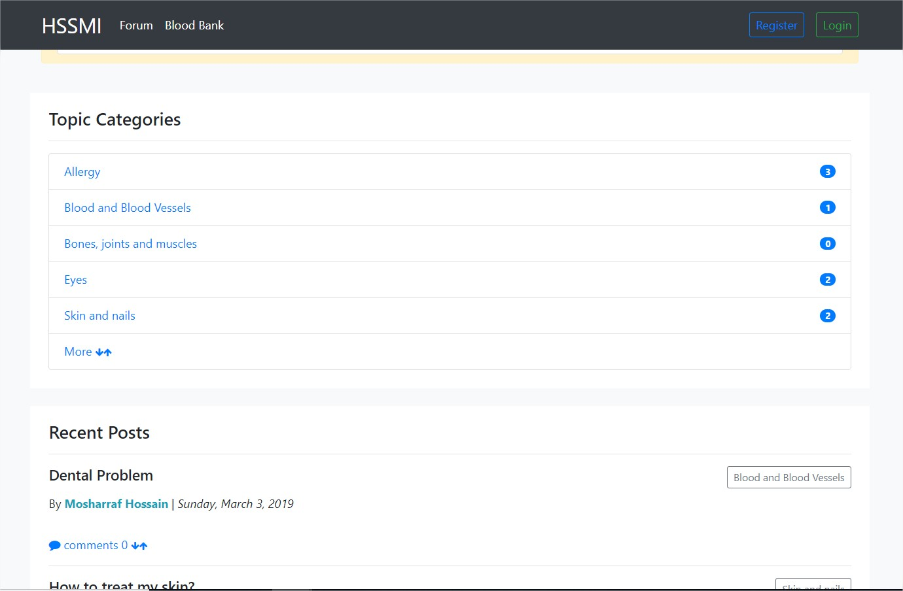

# Health Support System and Medical Information

This project is to develop software for the automation system where user can get a better health support instead of present manual system. It has four primary modules which are Doctor’s Info, Medical’s Info, Blood Bank and Forum. Here, a user can take appointment from Doctor and which is confirmed by a message via mobile. There are four login panels which are Admin, User, Doctor and Medical. They have individual interface and functions. The purpose of this project is to make the whole medical support in one platform. By this, User/patient can approach the best healthcare by knowing all information of medicals and doctors. Developed with ASP.Net MVC framework,C# and HTML5, CSS3, Bootstrap 4, JQuery and MS SQL Server as database.

NOTE: All the features are not included here because it is demo.

*How to get Database:
1. Open 'MS SQL Server Management Studio'
2. Create a Database "HealthSupportDB"
3. Open 'New Query' to write queries
4. Then Copy all the codes given in 'HealthSupport.sql' file and execute.

*How to run the Project:
1. Open the Project with Visual Studio.
2. Go to Web.Config file and change the Server name in connectionString.
3. Make sure database is set and server is running perfect.
4. Then run the project.

<h3>See Demo <a href="http://hssmi.somee.com/">here</a></h3>

<b>Doctor Dashboard:</b>
   
  
   
   
  <b>User Dashboard:</b>
    
  
   
   
  <b>Search Results for User:</b>
   
    
   
   
  <b>Medical Dashboard:</b>
   
    
   
   
  <b>Forum:</b>
   
  
   
   
  <b>Blood Bank:</b>
   
  

